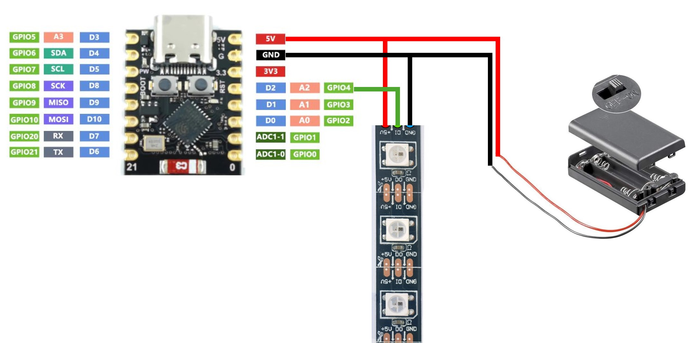

# Goal

The kidspace at 38c3 will provide some materials to tune our beloved bobby cars. The rest ist up to you.

This will not be a manual how to do it but a starting point. Be creative, break the rules, use illegal instructions and have fun.

## Provided material

 - WS2812b LED stripes
 - ESP32-C3 supermini boards w/ USB-C port
 - Battery holder für 3x AAA batteries
 - Cables and plugs

Of course, you can bring your own material, and you will find some place to work and solder at the congress.

## Hardware

The easiest way to connect will be like this:

If you use GPIO4 (as in the image) the preprogrammed software will produce a rainbow for starters.

## Software

The arduino sketch `rainbow.ino` is preprogrammed on all provided ESP32-C3. Feel free to modify it or programm your own code.
Actually it's more or less the default example of the Adafruit NeoPixel library. 

Bonus points for using Wi-Fi or bluetooth. The sky is the illegal limit.